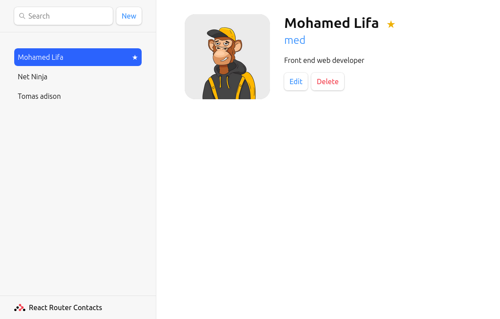

# React Router Contact Management Project

This project is a mini contact management application built with React Router. It serves as a practical implementation of the concepts learned from the React Router documentation on [react router](reactrouter.com). By following the tutorial and building this project, you have gained hands-on experience in utilizing React Router for navigation and routing within a React application.

## Project Overview

The contact management project allows users to perform various operations on contacts, including viewing, editing, and deleting. The application utilizes React Router to handle different routes and components for each functionality.



## Project Structure

The main components in the project are:

- `Index`: Renders the main page of the application, displaying a list of contacts.
- `Contact`: Renders the details of a specific contact.
- `EditContact`: Renders a form to edit the details of a contact.
- `Destroy`: Handles the deletion of a contact.
- `ErrorPage`: Displays an error page when an error occurs during routing.

## Getting Started

To get started with this project, please follow these steps:

- Clone the repository to your local machine using the following command:

```bash
    git clone https://github.com/Mohamed-lifa7/contacts-managment.git
```

- Change into the project's directory:

```bash
    cd contacts-managment
```

- Install the project dependencies:

```bash
    npm install
```

- Start the development server:

```bash
    npm run dev
```

- Open your web browser and navigate to [http://localhost:3000](http://localhost:3000) to view the application.

## Tutorial Progression

During the tutorial, i learned the following concepts:

1. Basic Setup: Setting up a new React project with Vite and installing React Router.

2. Route Configuration: Defining routes using  components and rendering corresponding components.

3. Route Parameters: Passing and extracting parameters from route URLs.

4. Nested Routes: Implementing nested routes for creating hierarchical navigation.

5. Programmatic Navigation: Navigating programmatically using history and Link components.

6. URL Parameters: Accessing URL parameters using useParams hook.

7. Redirects: Redirecting to different routes based on certain conditions.

8. Navigation Guards: Implementing navigation guards to control access to specific routes.

By following the tutorial,i gained a solid understanding of React Router's core concepts and how to use them effectively in my own projects.

## Acknowledgements

I would like to express my heartfelt gratitude to the open-source community, especially the team behind  [React Router](reactrouter.com), for providing such an excellent resource and tutorial. The efforts put into creating and maintaining React Router have significantly contributed to the development of robust routing solutions for React applications.

## Additional Resources

In addition to the tutorial, the  [React Router website](reactrouter.com) provides comprehensive documentation, guides, and examples to further enhance your understanding of React Router. Make sure to explore these resources to deepen your knowledge.

## Conclusion

Feel free to explore and expand upon the project, adding new routes and functionality to further enhance your skills with React Router.

Thank you again to the React Router team and the open-source community for their invaluable contributions!

### Happy routing!
